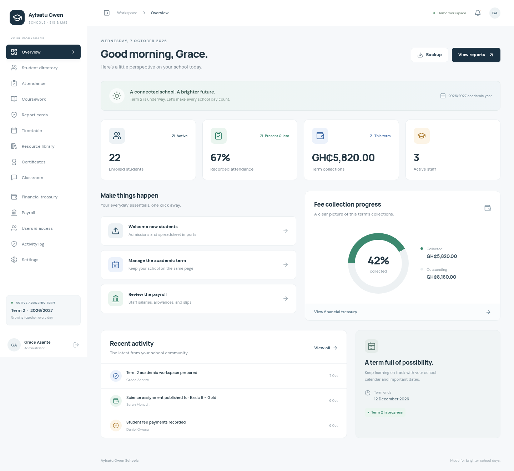

# Ayisatu Owen Schools

A responsive, frontend-only school information system and learning management workspace built from the supplied PRD and design references.

## Run locally

Requires Node.js 22.12+ (validated with Node 24) and npm.

```sh
npm ci
npm run dev
```

Open the Vite address shown in your terminal. Choose **Administrator**, **Teacher**, **Student**, or **Accountant** to explore. No credentials are needed: this is an explicitly labelled demo, not real authentication.

```sh
npm run build      # TypeScript check and production bundle in dist/
npm run preview    # Serve the production build
npm test           # Academic calculations and backup validation
npm run test:e2e   # Chromium interaction and responsive-layout checks
```

Playwright uses `/usr/bin/chromium` when available. On another machine, run `npx playwright install chromium`, or set `PLAYWRIGHT_CHROMIUM_EXECUTABLE` to your Chromium executable.

## Included workflows

- Four role-specific demo workspaces, guarded routes, and scoped class/student views.
- Overview dashboard with live summary cards, fee chart, quick actions, and activity.
- Student directory: search, class/status filters, pagination, admissions, editing, photos, class transfers, CSV export, and CSV/XLSX import with column mapping and duplicate prevention.
- Daily attendance: four statuses, bulk marking, save/reload persistence, monthly school-day matrix, standing indicators, and report-card counts.
- Coursework: create assignments, submit text or research links, review work, grade and provide feedback; graded points normalize to a 50-point SBA in report cards.
- Reports: subject scores, 50/50 totals, grade bands, Excel-style tied rankings, qualitative development fields, editable remarks, verification, photographs, and single-page A4 print/PDF layout.
- Timetable: seven teaching periods, assembly and recess, class/teacher filtering, mobile day tabs, edit/add periods, and teacher/room/class overlap prevention.
- Resource library: category/class/search filters, text handouts, hosted document/video links, previews, and downloads.
- Certificates: four award categories, student showcase, printable landscape certificates.
- Classroom announcement feed.
- Finance: per-class fee items, payment entry, recalculated balances, expenses, transactions, CSV exports, A4 and 58mm receipt layouts.
- Payroll: salary and allowance editing, deductions, net pay, status, CSV summary, and printable slips.
- Administration: editable school profile and crest, term/year control, demo user profiles and class assignments, activity log, SHA-256-verified local JSON backups, typed-confirmation restore/reset.

## Frontend scope and intentional limits

There is **no backend**, API server, Firebase connection, real account authentication, cloud sync, payment gateway, or AI integration. Role selection demonstrates navigation and data presentation; client-side checks are not a security boundary. Use sample data only.

Changes are saved to this browser’s `localStorage` under `aos-lms-demo-v1`; the selected role is kept in `sessionStorage`. They do not sync across browsers, tabs, or devices. Storage failures display a warning. Backups contain the demo workspace records and are schema-validated before restore.

Assignment file submission currently retains the filename as demo metadata; binary file storage is deferred. Resource files support local text handouts; PDFs, Office documents, and videos can be linked by URL. AI remarks, password resets, generated account credentials, direct messaging, receipt batch queues, and backend-authoritative audit/IP records are deferred. PDF export uses the browser’s Print → Save as PDF capability. Thermal output should still be verified on the target physical printer.

The UI uses calculated sample totals rather than the illustrative totals in the screenshots. Sample school information can be changed under Settings. The application bundles its fonts and has no required third-party runtime network calls.

## Structure

```text
src/App.tsx               Role entry, routing, responsive navigation
src/components/ui.tsx     Shared accessible controls, dialogs, cards
src/data.ts               Typed entities, sample data, academic calculations
src/store.tsx             Browser persistence, reactive state, exports
src/validation.ts         Backup schema and relationship validation
src/pages/                Academic, finance, student and admin screens
src/styles.css            Design system, responsive and print styles
src/data.test.ts          Calculation and integrity checks
tests/ui.spec.ts          End-to-end workflows and viewport checks
docs/product-requirements.md  Supplied product requirements
```

## Next phase

Replace the local store with authenticated service adapters, keeping the typed page models. Enforce role/class permissions on the server, add file storage and virus scanning, connect AI through a server-held key, and implement durable transactions, academic-year history, server audit logs, and cloud backup/restore. Backend work is intentionally outside this delivery.

## Screenshots



[Login screen](docs/screenshots/login.png) · [Phone overview](docs/screenshots/mobile-dashboard.png) · [Phone attendance](docs/screenshots/mobile-attendance.png)
